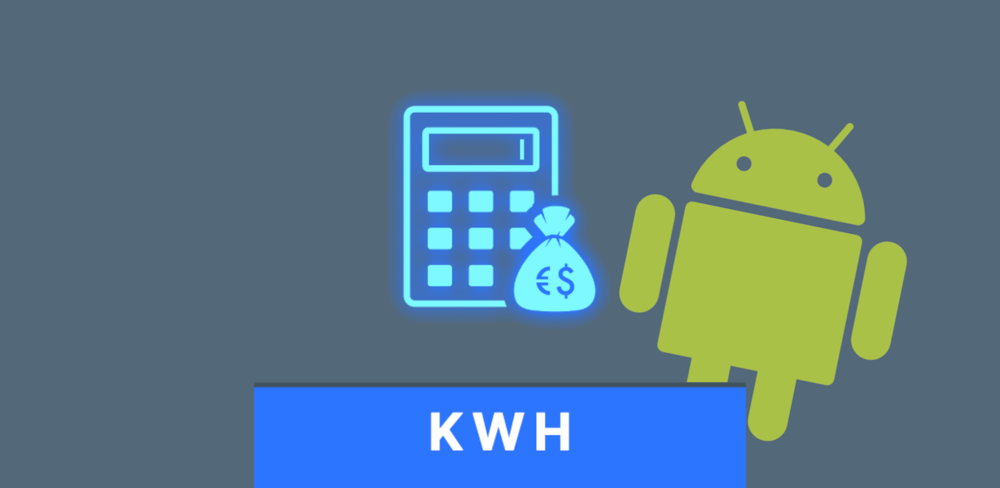
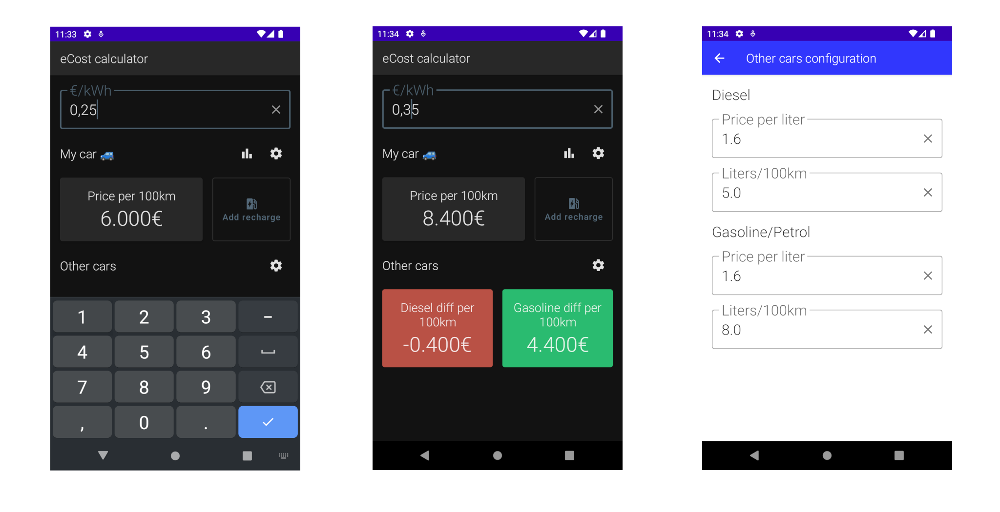

eCost for Android
==================
Application to help electric or hybrid car drivers to know if the price per kilowatt is worth it.
When traveling or commuting you usually find charging stations with prices that may differ even free but others extremely expensive.
With this application you can determine if the kWh price is worth it in comparison with diesel or gasoline.

# Features
Easy to see if the price is ok
Can compare with diesel and gasoline prices
Keep track of your recharges

# Screenshots

# Technical features
Project created using Kotlin as programming language.
The views are made with Compose.
Room and Datastore are used for persistence.